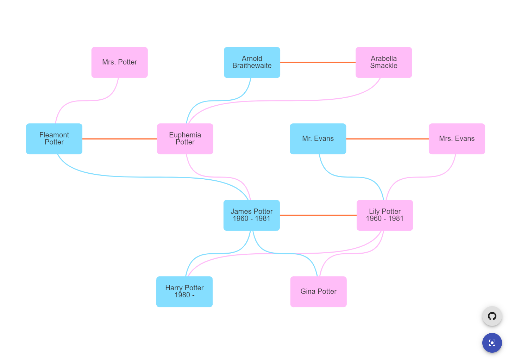

# Overview

Compilation of my favourite songs, poems, and spiritual verses.

English translations are done by me.

# Demo
Live demo: https://harmansran.github.io/punjabi-classics/

<!--  -->

# Continuous Testing
Testing (jest) and linting (eslint) workflow configured out of the box (see `<ROOT>/.github/workflows/test.yml`).

# Manual Deployment
Github Pages deployment has already been configured and works out of the box.

To trigger a production build, and deploy to Github Pages, run:
```
<ROOT> npm deploy
```